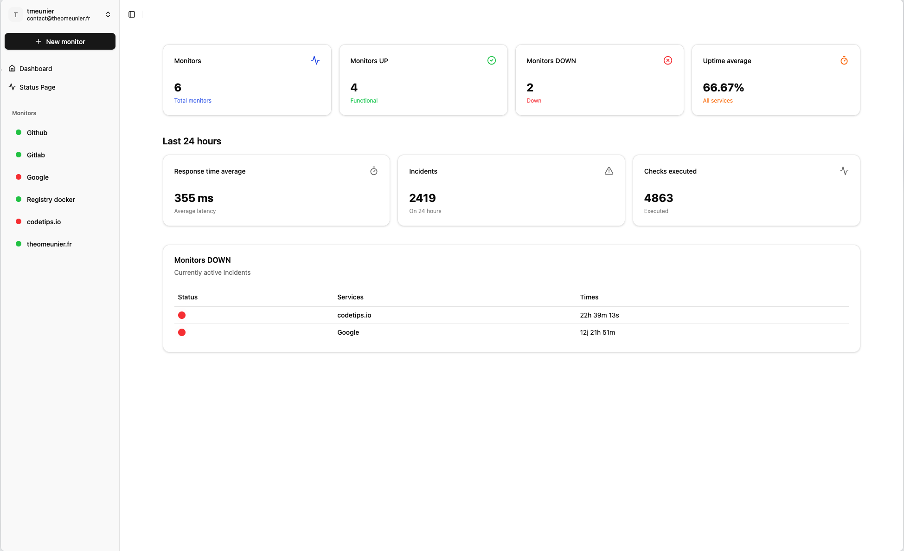
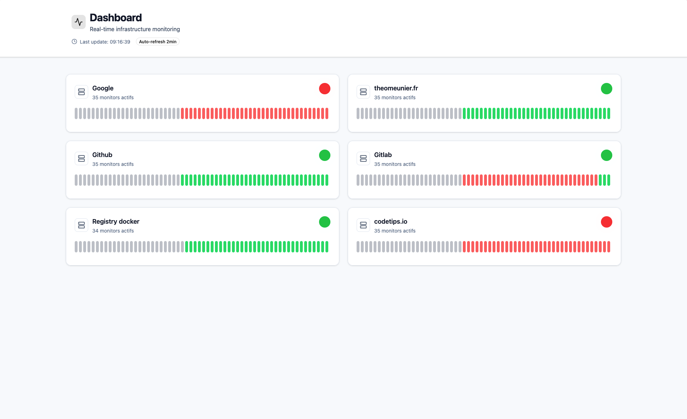
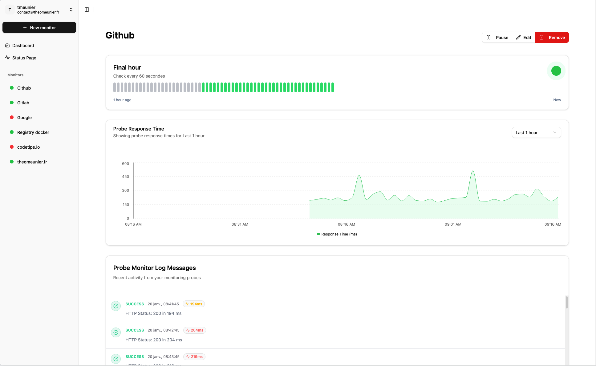

<div align="center">
<a href="https://github.com/TheoMeunier/uptime-kotlin">

</a>

<h2 align="center">Uptime Kotlin</h3>
  <p align="center">
    <a href="https://github.com/TheoMeunier/uptime-kotlin/issues/new?labels=bug&template=bug-report---.md">Report Bug</a>
    ·
    <a href="https://github.com/TheoMeunier/uptime-kotlin/issues/new?labels=enhancement&template=feature-request---.md">Request Feature</a>
  </p>
</div>

## About The Project

A simple, lightweight, and self-hostable uptime monitoring tool, built and optimized for cloud deployment.
Ideal for monitoring service availability without relying on external solutions.

<table>
  <tr>
    <td></td>
    <td></td>
    <td></td>
  </tr>
</table>

### Key Features

- HTTP/HTTPS, TCP, DNS and ping monitoring
- Real-time dashboard with historical data
- Multi-channel notifications (Email, Slack, Discord, Teams, Webhook)
- Public status pages for your users
- JWT authentication with encrypted data
- Docker-ready deployment

### Built With

- [Kotlin](https://kotlinlang.org/)
- [Quarkus](https://quarkus.io/)
- [React](https://reactjs.org/)
- [PostgreSQL](https://www.postgresql.org/)
- [Docker](https://www.docker.com/)

## Getting Started

1. Create keys for JWT token with `openssl`:

```bash
mkdir certs/ && cd certs

openssl genrsa -out rsaPrivateKey.pem 2048
openssl rsa -pubout -in rsaPrivateKey.pem -out publicKey.pem
openssl pkcs8 -topk8 -nocrypt -inform pem -in rsaPrivateKey.pem -outform pem -out privateKey.pem

chmod 644 privateKey.pem publicKey.pem
```

2. Create a `compose.yaml` file

```yml
services:
  uptime-kotlin-app:
    image: ghcr.io/theomeunier/uptime/app:latest
    container_name: uptime_kotlin_app
    restart: unless-stopped
    ports:
      - "80:80"
    networks:
      - app_network

  uptime-kotlin-api:
    image: ghcr.io/theomeunier/uptime/api:latest
    container_name: uptime_kotlin_api
    restart: unless-stopped
    ports:
      - "8080:8080"
    environment:
      QUARKUS_DATASOURCE_USERNAME: uptime
      QUARKUS_DATASOURCE_PASSWORD: uptime
      QUARKUS_DATASOURCE_JDBC_URL: jdbc:postgresql://uptime_database:5432/uptime
      ENCRYPTION_MASTER_KEY: superKeyMasterSensileData0123456789
      MP_JWT_VERIFY_PUBLICKEY_LOCATION: /certs/publicKey.pem
      MP_JWT_VERIFY_ISSUER: https://issuer.uptime-kotlin.com
      SMALLRYE_JWT_SIGN_KEY_LOCATION: /certs/privateKey.pem
    volumes:
      - ./certs:/certs
    networks:
      - app_network

  nginx:
    image: nginx:alpine
    container_name: uptime_kotlin_reverse_proxy
    restart: unless-stopped
    ports:
      - "8888:80"
    volumes:
      - ./docker/reverse-proxy/nginx.conf:/etc/nginx/conf.d/default.conf
    networks:
      - app_network

  postgres:
    image: postgres:17.4-alpine
    container_name: uptime_kotlin_database
    restart: unless-stopped
    ports:
      - "5432:5432"
    environment:
      POSTGRES_DB: uptime-kotlin
      POSTGRES_USER: uptime-kotlin
      POSTGRES_PASSWORD: uptime-kotlin
      PGDATA: /var/lib/postgresql/data/pgdata
    volumes:
      - ./storage-db:/var/lib/postgresql/data
    networks:
      - app_network

networks:
  app_network:
    driver: bridge

```

3. Configure the `variable environnement` file

   3.1 Encrypted variables:

    - `ENCRYPTION_MASTER_KEY` : The master key used to encrypt sensitive data

   3.2 PostgreSQL Configuration:

    - `QUARKUS_DATASOURCE_USERNAME` : The username of your PostgreSQL database
    - `QUARKUS_DATASOURCE_PASSWORD` : The password of your PostgreSQL database
    - `QUARKUS_DATASOURCE_JDBC_URL=jdbc:postgresql://[host][:port][/database]` : The URL of your PostgreSQL database

   3.3 JWT Configuration:

    - `MP_JWT_VERIFY_PUBLICKEY_LOCATION` : The location of the public key used to verify the JWT token
    - `MP_JWT_VERIFY_ISSUER` : The issuer of the JWT token
    - `SMALLRYE_JWT_SIGN_KEY_LOCATION` : The location of the private key used to sign the JWT token

4. Start the application with docker-compose

```bash
   docker compose up -d
```

5. Access the application

```bash
   http://localhost:8888
```

## Contributing

Contributions are what make the open source community such an amazing place to learn, inspire, and create. Any
contributions you make are **greatly appreciated**.

If you have a suggestion that would make this better, please fork the repo and create a pull request. You can also
simply open an issue with the tag "enhancement".
Don't forget to give the project a star! Thanks again!

1. Fork the Project
2. Create your Feature Branch (`git checkout -b feature/AmazingFeature`)
3. Commit your Changes (`git commit -m 'Add some AmazingFeature'`)
4. Push to the Branch (`git push origin feature/AmazingFeature`)
5. Open a Pull Request

## License

Distributed under the MIT License. See `LICENSE` for more information.