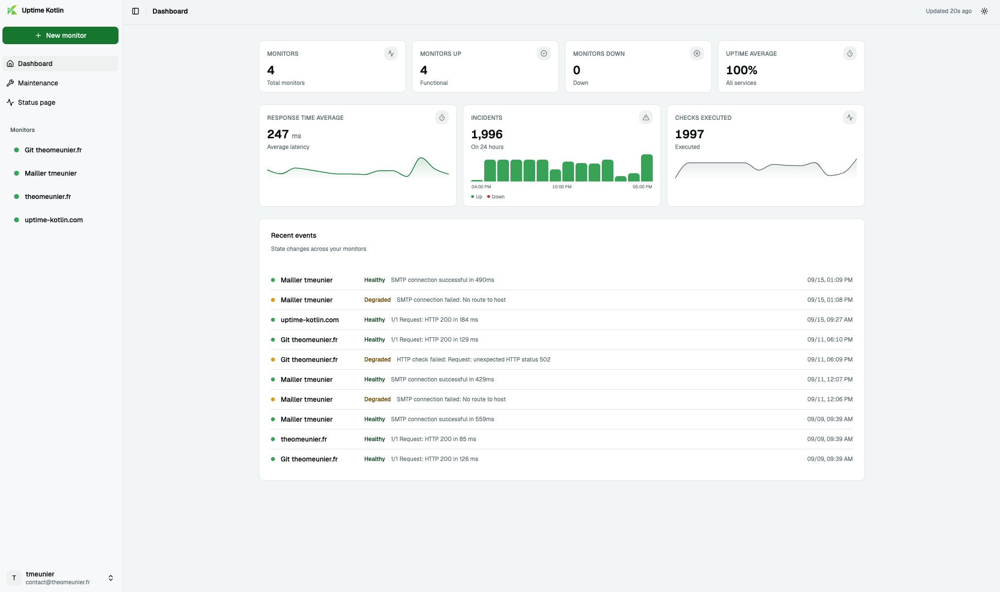
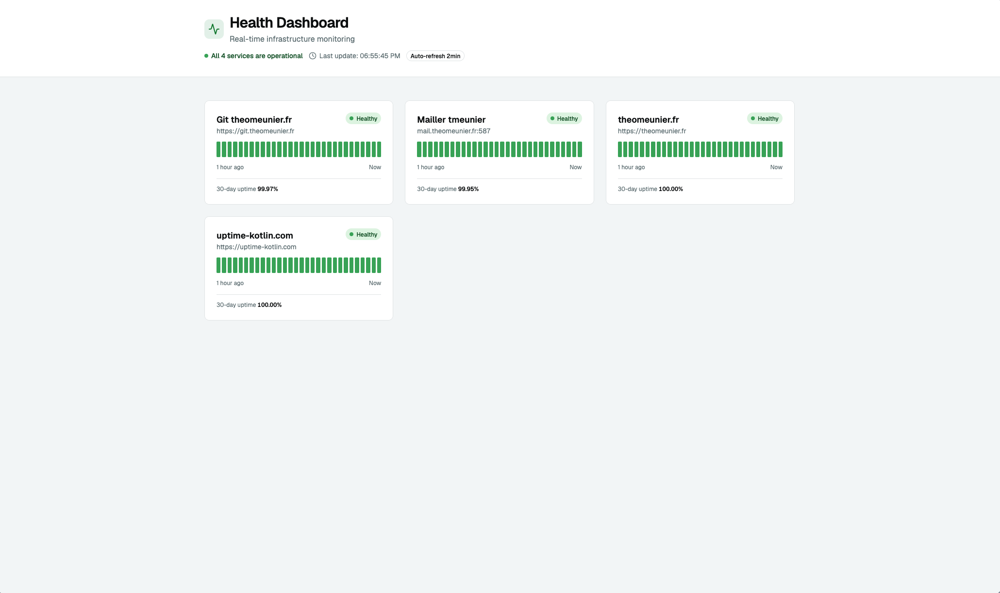
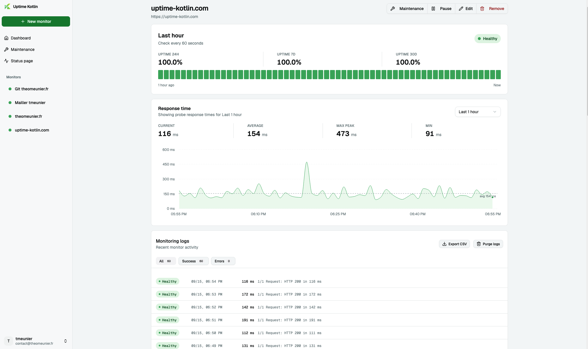

<div align="center">
<a href="https://github.com/TheoMeunier/uptime-kotlin">

</a>

<h2 align="center">Uptime Kotlin</h2>

<p align="center">
  <a href="https://github.com/TheoMeunier/uptime-kotlin/releases">
    
  </a>
  <a href="LICENSE">
    
  </a>
<a href="https://github.com/TheoMeunier/uptime-kotlin/actions/workflows/back-ci.yml">
    
  </a>
  <a href="https://github.com/TheoMeunier/uptime-kotlin/actions/workflows/app-ci.yml">
    
  </a>
</p>

<p align="center">
<a href="https://github.com/TheoMeunier/uptime-kotlin/issues/new?labels=bug&template=bug-report---.md">Report Bug</a>
·
<a href="https://github.com/TheoMeunier/uptime-kotlin/issues/new?labels=enhancement&template=feature-request---.md">Request Feature</a>
</p>
</div>

## About The Project

Self-hosted uptime monitoring for HTTP, TCP, DNS, databases, Kafka, RabbitMQ and more. Public status pages,
multi-channel notifications, and a worker-based cluster mode to scale your checks.

<table>
  <tr>
    <td></td>
    <td></td>
    <td></td>
  </tr>
</table>

### Key Features

- HTTP/HTTPS, TCP, DNS, ping, PostgreSQL, Microsoft SQL Server, MySQL/MariaDB, Redis, SMTP, Kafka and RabbitMQ
  monitoring
- Real-time dashboard with historical data
- Multi-channel notifications (Email, Slack, Discord, Teams, Webhook), with periodic resend while a monitor
  stays down (per-monitor interval, disabled by default)
- Public status pages for your users
- JWT authentication with encrypted data
- Docker-ready deployment (amd64 and native ARM64 images)

### Built With

- [Kotlin](https://kotlinlang.org/)
- [Quarkus](https://quarkus.io/)
- [React](https://reactjs.org/)
- [PostgreSQL](https://www.postgresql.org/)
- [Docker](https://www.docker.com/)

## Getting Started

1. Create keys for JWT token with `openssl`:

```bash
mkdir certs/ && cd certs

openssl genrsa -out rsaPrivateKey.pem 2048
openssl rsa -pubout -in rsaPrivateKey.pem -out publicKey.pem
openssl pkcs8 -topk8 -nocrypt -inform pem -in rsaPrivateKey.pem -outform pem -out privateKey.pem

chmod 644 privateKey.pem publicKey.pem
```

2. Create a `compose.yaml` file

> [!TIP]
> Deploying on an ARM64 host (Raspberry Pi, AWS Graviton, ...)? See [ARM64](#arm64) for the image names to use.

Download the Nginx reverse proxy configuration into a `docker/` folder next to your `compose.yaml`:

```bash
mkdir -p docker && curl -o docker/nginx.conf \
  https://raw.githubusercontent.com/TheoMeunier/uptime-kotlin/main/docker/nginx.conf
```

The reverse proxy is not optional: the frontend calls the API with relative URLs (`/api/...`), so both must
answer on the same origin. Only Nginx publishes a port — the app and the API are reached through it.

```yml
services:
  uptime-kotlin-app:
    image: ghcr.io/theomeunier/uptime-kotlin/app:latest
    container_name: uptime_kotlin_app
    restart: unless-stopped
    networks:
      - app_network

  uptime-kotlin-api:
    image: ghcr.io/theomeunier/uptime-kotlin/api:latest
    container_name: uptime_kotlin_api
    restart: unless-stopped
    environment:
      TZ: Europe/Paris
      SCHEDULER_STRATEGY: database
      QUARKUS_DATASOURCE_USERNAME: uptime-kotlin
      QUARKUS_DATASOURCE_PASSWORD: change-me
      QUARKUS_DATASOURCE_JDBC_URL: jdbc:postgresql://postgres:5432/uptime-kotlin
      ENCRYPTION_MASTER_KEY: change-me-32-characters-minimum-0
      MP_JWT_VERIFY_PUBLICKEY_LOCATION: /certs/publicKey.pem
      MP_JWT_VERIFY_ISSUER: https://issuer.uptime-kotlin.com
      SMALLRYE_JWT_SIGN_KEY_LOCATION: /certs/privateKey.pem
    volumes:
      - ./certs:/certs
    depends_on:
      - postgres
    networks:
      - app_network

  nginx:
    image: nginx:alpine
    container_name: uptime_kotlin_reverse_proxy
    restart: unless-stopped
    ports:
      - "8080:80"
    volumes:
      - ./docker/nginx.conf:/etc/nginx/conf.d/default.conf
    depends_on:
      - uptime-kotlin-api
      - uptime-kotlin-app
    networks:
      - app_network

  postgres:
    image: postgres:17.4-alpine
    container_name: uptime_kotlin_database
    restart: unless-stopped
    environment:
      POSTGRES_DB: uptime-kotlin
      POSTGRES_USER: uptime-kotlin
      POSTGRES_PASSWORD: change-me
      PGDATA: /var/lib/postgresql/data/pgdata
    volumes:
      - ./storage-db:/var/lib/postgresql/data
    networks:
      - app_network

networks:
  app_network:
    driver: bridge
```

3. Configure the `variable environnement` file

   3.1 Encrypted variables:

    - `ENCRYPTION_MASTER_KEY` : The master key used to encrypt sensitive data. Required, at least 32 bytes
      (`openssl rand -base64 32`). The application refuses to start without it.

   3.2 PostgreSQL Configuration:

    - `QUARKUS_DATASOURCE_USERNAME` : The username of your PostgreSQL database
    - `QUARKUS_DATASOURCE_PASSWORD` : The password of your PostgreSQL database
    - `QUARKUS_DATASOURCE_JDBC_URL=jdbc:postgresql://[host][:port][/database]` : The URL of your PostgreSQL database

   3.3 JWT Configuration:

    - `MP_JWT_VERIFY_PUBLICKEY_LOCATION` : The location of the public key used to verify the JWT token
    - `MP_JWT_VERIFY_ISSUER` : The issuer of the JWT token
    - `SMALLRYE_JWT_SIGN_KEY_LOCATION` : The location of the private key used to sign the JWT token

   3.4 Schedulers Configuration:

    - `SCHEDULER_STRATEGY` : `database` (the API runs the monitoring checks and the other background jobs itself),
      or `none` when dedicated workers run them (see [Cluster mode](#cluster-mode)).
    - `SCHEDULER_WORKER_CONCURRENCY` (default `4`) : checks run in parallel, and at most this many checks start per
      second. Keep it under the datasource pool size.

   `QUARKUS_SCHEDULER_STRATEGY=db-lock` from previous versions is still understood as `SCHEDULER_STRATEGY=database`
   and logs a deprecation warning: replace it.

   3.5 Maintenance windows (set the same values on the API and the workers):

    - `MAINTENANCE_HORIZON_DAYS` (default `90`) : how far ahead recurring windows are unrolled into occurrences.
    - `MAINTENANCE_MAX_DURATION_HOURS` (default `24`) : longest window the API accepts.


4. Start the application with docker-compose

```bash
   docker compose up -d
```

5. Access the application

```bash
   http://localhost:8888
```

### Cluster mode

By default the API runs everything. The cluster mode moves the background jobs (monitoring checks, notifications,
maintenance windows, purges) to one or more workers. Both modes run the same engine: a job queue stored in
PostgreSQL, which the workers share without running a check twice. No extra service is required.

#### Add Workers

```yaml
uptime-kotlin-worker:
  image: ghcr.io/theomeunier/uptime-kotlin/worker:latest
  container_name: uptime_kotlin_worker
  environment:
    TZ: Europe/Paris
    SCHEDULER_STRATEGY: database
    SCHEDULER_WORKER_NAME: worker-primary
    SCHEDULER_WORKER_CONCURRENCY: "4"
    MAINTENANCE_HORIZON_DAYS: "90"
    MAINTENANCE_MAX_DURATION_HOURS: "24"
    QUARKUS_DATASOURCE_USERNAME: uptime-kotlin
    QUARKUS_DATASOURCE_PASSWORD: change-me
    QUARKUS_DATASOURCE_JDBC_URL: jdbc:postgresql://postgres:5432/uptime-kotlin
    ENCRYPTION_MASTER_KEY: change-me-32-characters-minimum-0
  depends_on:
    - uptime-kotlin-api
  networks:
    - app_network

```

#### Configure the `variable environnement` file

1. Cluster mode

   On the **API**: `SCHEDULER_STRATEGY` set to `none`, so that only the workers run the background jobs.

   On each **worker** (these are `SCHEDULER_*` variables, not `QUARKUS_SCHEDULER_*`):

    - `SCHEDULER_STRATEGY`: `database` to run checks from the queue, `none` (default) to stay idle.
    - `SCHEDULER_WORKER_NAME`: name of the worker, unique for each instance. Checks queued under a name that no
      running instance uses any more are picked up by the others after 30 seconds.
    - `SCHEDULER_WORKER_CONCURRENCY` (default `4`): checks run in parallel by this worker. Keep it under the datasource
      pool size.

### ARM64

The API and the worker are also published as native ARM64 images, for any ARM64 host (Raspberry Pi, AWS Graviton,
Ampere servers, Apple Silicon, ...). Use the `compose.yaml` from [Getting Started](#getting-started) and only swap
these two images; `nginx` and `postgres` are multi-architecture and run as is.

| Component | amd64                                      | arm64                                            |
|-----------|--------------------------------------------|--------------------------------------------------|
| API       | `ghcr.io/theomeunier/uptime-kotlin/api`    | `ghcr.io/theomeunier/uptime-kotlin/api-arm64`    |
| Worker    | `ghcr.io/theomeunier/uptime-kotlin/worker` | `ghcr.io/theomeunier/uptime-kotlin/worker-arm64` |

> [!IMPORTANT]
> The host must run a 64-bit OS: `uname -m` must print `aarch64` (or `arm64`). 32-bit ARM (`armv7l`) is not
> supported, e.g. a Raspberry Pi running a 32-bit OS.
> The `app` (frontend) image is currently published for amd64 only.

<details>
<summary>Troubleshooting & building the images yourself</summary>

- `exec format error` when a container starts: the image was built for another architecture. Check that the image
  name ends with `-arm64`.
- To build the images locally, use an ARM64 machine (Apple Silicon Mac, ARM Linux) with JDK 21 and Docker (at least
  6 GB of RAM for Docker, native compilation is memory hungry):

  ```bash
  ./scripts/build-arm64.sh          # build the images locally
  ./scripts/build-arm64.sh --save   # also export them to dist-docker/, to copy them to the target host
  ```

</details>

## Contributing

Contributions are what make the open source community such an amazing place to learn, inspire, and create. Any
contributions you make are **greatly appreciated**.

If you have a suggestion that would make this better, please fork the repo and create a pull request. You can also
simply open an issue with the tag "enhancement". Don't forget to give the project a star! Thanks again!

1. Fork the Project
2. Create your Feature Branch (`git checkout -b feature/AmazingFeature`)
3. Commit your Changes (`git commit -m 'Add some AmazingFeature'`)
4. Push to the Branch (`git push origin feature/AmazingFeature`)
5. Open a Pull Request

## License

Distributed under the MIT License. See `LICENSE` for more information.
